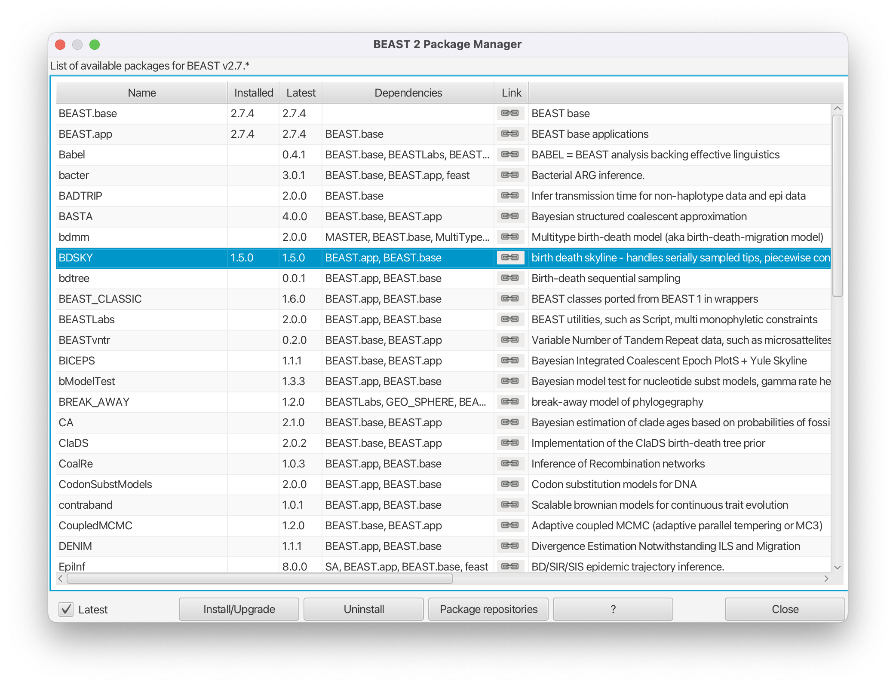
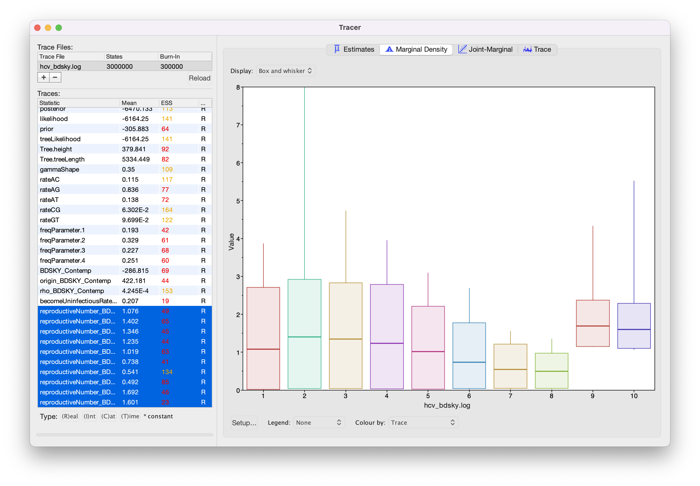

# Background

Population dynamics influence the shape of the tree and consequently, the shape of the tree contains some information about past population dynamics. The so-called Skyline methods allow to extract this information from phylogenetic trees in a non-parametric manner. It is non-parametric since there is no underlying system of differential equations governing the inference of these dynamics. In this tutorial we will look at two different methods to infer these dynamics from sequence data. The first one is the Coalescent Bayesian Skyline plot , which is based on the coalescent model, and the second one is the Birth-Death Skyline plot  based on the birth-death model. The conceptual difference between coalescent and birth-death approaches lies in the direction of the flow of time. In the coalescent, the time is modeled to go backwards, from present to past, while in the birth-death approach it is modeled to go forwards. Two other fundamental differences are the parameters that are inferred and the way sampling is treated. 

----

# Programs used in this Exercise


### BEAST2 - Bayesian Evolutionary Analysis Sampling Trees 2

BEAST2 ([http://www.beast2.org](http://www.beast2.org)) is a free software package for Bayesian evolutionary analysis of molecular sequences using MCMC and strictly oriented toward inference using rooted, time-measured phylogenetic trees. This tutorial is written for BEAST v{{ page.beastversion }} .


### BEAUti - Bayesian Evolutionary Analysis Utility

BEAUti2 is a graphical user interface tool for generating BEAST2 XML configuration files.

Both BEAST2 and BEAUti2 are Java programs, which means that the exact same code runs on all platforms. For us it simply means that the interface will be the same on all platforms. The screenshots used in this tutorial are taken on a Mac OS X computer; however, both programs will have the same layout and functionality on both Windows and Linux. BEAUti2 is provided as a part of the BEAST2 package so you do not need to install it separately.


### Tracer

Tracer ([http://beast.community/tracer](http://beast.community/tracer)) is used to summarise the posterior estimates of the various parameters sampled by the Markov Chain. This program can be used for visual inspection and to assess convergence. It helps to quickly view median estimates and 95% highest posterior density intervals of the parameters, and calculates the effective sample sizes (ESS) of parameters. It can also be used to investigate potential parameter correlations. We will be using Tracer v{{ page.tracerversion }}.


### R / RStudio

We will be using [R](\href{https://www.r-project.org) to analyze the output of the Birth-Death Skyline plot. [RStudio](https://www.rstudio.com/) provides a user-friendly graphical user interface to R that makes it easier to edit and run scripts. (It is not necessary to use RStudio for this tutorial).

----


# Practical: Bayesian and Birth-Death Skyline Plots

In this tutorial we will estimate the dynamics of the Egyptian Hepatitis C epidemic from genetic sequence data collected in 1993.

The aim of this tutorial is to:

- Learn how to infer population dynamics;
- Get to know how to choose the set-up of a skyline analysis;
- Get to know the advantages and disadvantages of the Coalescent Bayesian Skyline Plot and the Birth-Death Skyline.


## The Data
The dataset consists of an alignment of 63 Hepatitis C sequences sampled in 1993 in Egypt . This dataset has been used previously to test the performance of skyline methods  .

With an estimated 15-25%, Egypt has the highest Hepatits C prevalence in the world. In the mid 20^(th) century, the prevalence of Hepatitis C increased drastically (see [Figure 1](#fig:prevalence) for estimates). We will try to infer this increase from sequence data. 

The alignment file can be downloaded from the Taming the BEAST website at [https://taming-the-beast.org/tutorials/Skyline-plots/](https://taming-the-beast.org/tutorials/Skyline-plots/) by downloading the file `hcv.nexus` from the left-hand panel, under the heading **Date**.

<figure>
	<a id="fig:prevalence"></a>
	
	<figcaption>Figure 1: The growth of the effective population size of the Hepatitis C epidemic in Egypt .</figcaption>
</figure>
<br>


## Creating the Analysis Files with BEAUti

We will use BEAUti to generate the configuration file for BEAST2 from the sequence alignment.

### Install BEAST 2 packages

While the coalescent-based Bayesian Skyline Plot is integrated in the BEAST2 core, we need to install the BDSKY package, which contains the Birth-Death Skyline model. Installation of packages is done using the package manager, which is integrated into BEAUti. 


> Open the **BEAST2 Package Manager** by navigating to **File > Manage Packages**. 
> 
> Install the **BDSKY** package by selecting it and clicking the **Install/Upgrade** button ([Figure 2](#fig:install)).
>

After the installation of a package, the program is on your computer, but BEAUti is unable to load the template files for the newly installed model unless it is restarted. So, let's restart BEAUti to make sure we have the **BDSKY** model at hand.


> Close the **BEAST2 Package Manager** and **_restart_** BEAUti to fully load the **BDSKY** package.
> 

<figure>
	<a id="fig:install"></a>
	
	<figcaption>Figure 2: Install the BDSKY package which contains the Birth-Death Skyline model.</figcaption>
</figure>
<br>

----

### Setting up the Coalescent Bayesian Skyline analysis

To start we have to import the alignment into BEAUti.

> In the **Partitions** panel, import the nexus file with the alignment by navigating to **File > Import Alignment** in the menu and then finding the `hcv.nexus` file on your computer **or** simply drag and drop the file into the **BEAUti** window.
> 

BEAUti will recognize the sequences from the `*.nexus` file as nucleotide data. It will do so for sequence files with the character set of **A | C | G | T | N**, where **N** indicates an unknown nucleotide. As soon as other non-gap characters are included (e.g. using **R** or **Y** to indicate purines and pyramidines) BEAUti will not recognize the data as nucleotides anymore (unless the type of data is specified in the `*.nexus` file) and open a dialogue box to confirm the data type.

The sequences were all sampled in 1993 so we are dealing with a homochronous alignment and do not need to specify tip dates. 

> Skip the **Tip Dates** panel and navigate to the **Site Model** panel.
>

The next step is to specify the model of nucleotide evolution (the site model). We will be using the GTR model, which is the most general reversible model and estimates transition probabilities between individual nucleotides separately. That means that the transition probabilities between e.g. **A** and **T** will be inferred separately to the ones between **A** and **C**, however transition probabilities from **A** to **C** will be the same as **C** to **A** etc. Additionally, we allow for rate heterogeneity among sites. We do this by changing the Gamma Category Count to 4 (normally between 4 and 6).

> Change the **Gamma Category Count** to 4, make sure that the estimate box next to the **Shape** parameter of the Gamma distribution is ticked and set **Subst Model** to **GTR**. Make sure that the estimate box is ticked for all but one of the 6 rates (there should be 5 ticked boxes) and that **Frequencies** are estimated ([Figure 3](#fig:model)).
>

<figure>
	<a id="fig:model"></a>
	
	<figcaption>Figure 3: Set a GTR site model with a Gamma Category Count of 4.</figcaption>
</figure>
<br>

> **Topic for discussion:** Why are only 5 of the 6 rates of the GTR model estimated? 
>

Because our sequences are contemporaneous (homochronous data) there is no information in our dataset to estimate the clock rate (for more information on this refer to the [prior-selection](../Prior-selection/) tutorial) and we have to use external information to calibrate the clock. We will use an estimate inferred in  to fix the clock rate. In this case all the samples were contemporaneous (sampled at the same time) and the clock rate is simply a scaling of the estimated tree branch lengths (in substitutions/site) into calendar time.

> Navigate to the **Clock Model** panel.
> 
> Leave the clock model as a **Strict Clock** and set **Clock.rate** to 0.00079 s/s/y ([Figure 4](#fig:clockmodel)). 
> (Note that BEAUti is smart enough to know that the clock rate cannot be estimated on this dataset and grays out the estimate checkbox).
>

<figure>
	<a id="fig:clockmodel"></a>
	
	<figcaption>Figure 4: Set the clock rate to 0.00079 s/s/y.</figcaption>
</figure>
<br>

Now we are ready to set up the Coalescent Bayesian Skyline as a tree-prior. 

> Navigate to the **Priors** panel and select **Coalescent Bayesian Skyline** as the tree prior ([Figure 5](#fig:coalescent)).
>

<figure>
	<a id="fig:coalescent"></a>
	
	<figcaption>Figure 5: Choose the Coalescent Bayesian Skyline as a tree prior.</figcaption>
</figure>
<br>

The Coalescent Bayesian Skyline divides the time between the present and the root of the tree (the tMRCA) into segments, and estimates a different effective population size () for each segment. The endpoints of segments are tied to the branching times (also called coalescent events) in the tree ([Figure 6](#fig:coal_events)), and the size of segments is measured in the number of coalescent events included in each segment. The Coalescent Bayesian Skyline groups coalescent events into segments and jointly estimates the  (**bPopSizes** parameter in BEAST) and the size (**bGroupSizes** parameter) of each segment. To set the number of segments we have to change the dimension of **bPopSizes** and **bGroupSizes** (note that the dimension of both parameters has to be the same). Note that the length of a segment is not fixed, but dependent on the timing of coalescent events in the tree ([Figure 6](#fig:coal_events)), as well as the number of events contained within a segment (**bGroupSizes**). 


<figure>
	<a id="fig:coal_events"></a>
	
	<figcaption>Figure 6: Example tree where the red dotted lines show the time-points of coalescent events.</figcaption>
</figure>
<br>


> To change the number of segments we have to navigate to the **Initialialization** panel, which is by default not visible. Navigate to **View > Show Initialization Panel** to make it visible and navigate to it ([Figure 7](#fig:init)).
>
> Set the dimension of **bPopSizes** and **bGroupSizes** to 4 (the default value is 5) ([Figure 8](#fig:dimensions)). 
>

<figure>
	<a id="fig:init"></a>
	
	<figcaption>Figure 7: Show the initialization panel.</figcaption>
</figure>
<br>

<figure>
	<a id="fig:dimensions"></a>
	
	<figcaption>Figure 8: Set the dimension of bPopSizes and bGroupSizes to 4.</figcaption>
</figure>
<br>

This sets the number of segments equal to 4 (the parameter dimension), which means  will be allowed to change 3 times between the tMRCA and the present (if we have   segments,  is allowed to change  times). 

We can leave the rest of the priors as they are and save the XML file. We want to shorten the chain length and decrease the sampling frequency so the analysis completes in a reasonable time and the output files stay small. (Keep in mind that it will be necessary to run a longer chain for parameters to mix properly).

> Navigate to the **MCMC** panel. 
>
> Change the **Chain Length** from 10'000'000 to 3'000'000.
> 
> Click on the arrow next to the **tracelog** and change the **File Name** to `$(filebase).log` and set the 
> **Log Every** to 3'000.
> 
> Click on the arrow next to the **treelog** and change the **File Name** to `$(filebase).$(tree).log` and set the 
> **Log Every** to 3'000.
> 
> Leave all other settings at their default values and save the file as `hcv_coal.xml`.
>

When we run the analysis `$(filebase)` in the name of the `*.log` and `*.trees` files will be replaced by the name of the XML file. This is a good idea, since it makes it easy to keep track of which XML files produced which output files.

Now we are ready to run the analysis.

> Start **BEAST2** and choose the file `hcv_coal.xml`. 
> 
> If you have **BEAGLE** installed tick the box to **Use BEAGLE library if available**, which will make the run faster.
>
> Hit **Run** to start the analysis.
>

The analysis will take about 10 minutes to complete. Read through the next section while waiting for your results or start preparing the XML file for the [birth-death skyline](#sec:bdsky) analysis.


### The Coalescent Bayesian Skyline parameterization

The coalescent model that the Coalescent Bayesian Skyline is based on assumes that the sequences represent a small sample from a haploid population evolving under Wright-Fisher dynamics ([Figure 9](#fig:wrightfisher)). The model works by calculating the probability of the tree under this assumption. This essentially boils down to repeatedly asking the question of how likely it is for two lineages to coalesce (have a common ancestor) in a given time. 

<figure>
	<a id="fig:wrightfisher"></a>
	
	<figcaption>Figure 9: The basic principle behind the coalescent. Figure from .</figcaption>
</figure>
<br>

The effective population size () is the inverse of the rate of coalescence . The larger  is the less likely lineages are to coalesce. Thus, intervals in a sampled tree with many branching events often coincide with periods when the population size was small. Similarly, few branching events occur during periods of large population size. (Note that these results are conditioned on sampling only a small fraction of the population). 



For an SIR model (**S**usceptible, **I**nfected and **R**ecovered),  is proportional to the overall population size  and the number of infected  and inversely proportional to the transmission rate . 




Estimates of  therefore do not directly tell us something about the number of infected, nor the transmission rate. However, changes in  can be informative about changes in the transmission rate or the number of infected (if they do not cancel out).

The Coalescent Bayesian Skyline model allows  to change over time in a nonparametric fashion (i.e. we do not have to specify an equation governing changes in  over time). Another way to think about the model is as maximally-parameterized, since it infers  change-point times (segment boundaries) and a value for  in each segment. This makes the Bayesian Skyline flexible enough to model very complicated  dynamics, provided that enough segments are specified. 
It may be tempting to specify the maximum dimension for the model (each group contains only one coalescent event, thus  changes at each branching time in the tree), making it as flexible as possible. This is the parameterization used by the Classic Skyline plot , which is the direct ancestor of the Coalescent Bayesian Skyline plot. 
However, the only informative events used by the Coalescent Bayesian Skyline plot are the coalescent events. Thus, using a maximally-flexible parameterization with only one informative event per segment often leads to erratic and noisy estimates of  over time (especially if segments are very short, see [Figure 6](#fig:coal_events)). Grouping segments together leads to smoother and more robust estimates.

Choosing the dimension for the Bayesian Skyline can be rather arbitrary. If the dimension is chosen too low, not all population size changes are captured, but if it is chosen too large, there may be too little information in a segment to support a robust estimate. When trying to decide if the dimension is appropriate it may be useful to consider the average number of informative (coalescent) events per segment. (A tree of  taxa has  coalescences, thus  in each segment is estimated from on average  informative data points). Would this number of random samples drawn from a hypothetical distribution allow you to accurately estimate the distribution? If not, consider decreasing the dimension.
There are descendants of the coalescent skyline in BEAST that either estimate the number of segments (Extended Bayesian Skyline ) or do not require the number of segments to be specified (Skyride ), but instead makes very strong prior assumptions about changes in .


### Exploring the results of the Coalescent Bayesian Skyline analysis

For the reconstruction of the population dynamics, we need two files, the `*.log` file and the `*.trees` file. The log file contains the information about the group sizes and population sizes of each segment, while the trees file is needed for the times of the coalescent events. 

> Load the logfile into **Tracer** to check mixing and parameter estimates ([Figure 10](#fig:tracer_bsp)).  
>

<figure>
	<a id="fig:tracer_bsp"></a>
	
	<figcaption>Figure 10: Loading the log file into Tracer.</figcaption>
</figure>
<br>

Because we shortened the chain most parameters have very low ESS values. If you like, you can compare your results with the example results we obtained with identical settings and a chain of 30,000,000 (`hcv_coal_30M.log`).  

> Navigate to **Analysis > Bayesian Skyline Reconstruction**. From there open the `*.trees` file. To get the correct dates in the analysis we should specify the **Age of the youngest tip**. In our case it is 1993, the year where all the samples were taken. If the sequences were sampled at different times (heterochronous data), the age of the youngest tip is the time when the most recent sample was collected. 
> 
> Press **OK** to reconstruct the past population dynamics ([Figure 11](#fig:trees)).
>

<figure>
	<a id="fig:trees"></a>
	
	<figcaption>Figure 11: Reconstructing the Bayesian Skyline plot in Tracer.</figcaption>
</figure>
<br>

The output will have the years on the x-axis and the effective population size on the y-axis. By default, the y-axis is on a log-scale. If everything worked as it is supposed to work you will see a sharp increase in the effective population size in the mid 20^(th) century, similar to what is seen on [Figure 12](#fig:skyline).

(Note that the reconstruction will only work if the `*.log` and `*.trees` files contain the same number of states and both files were logged at the same frequency).

<figure>
	<a id="fig:skyline"></a>
	
	<figcaption>Figure 12: Coalescent Bayesian Skyline analysis output. The black line is the median estimate of the estimated effective population size (can be changed to the mean estimate). The two blue lines are the upper and lower bounds of the 95% HPD interval. The x-axis is the time in years and the y-axis is on a log-scale.</figcaption>
</figure>
<br>

There are two ways to save the analysis, it can either be saved as a `*.pdf` for display purposes or as a tab delimited file. 

> Navigate to **File > Export Data Table**. 
> 
> Enter the filename as `hcv_coal.tsv` and save the file.
>

The exported file will have five rows, the time, the mean, median, lower and upper boundary of the 95% HPD interval of the estimates, which you can use to plot the data with other software (R, Matlab, etc).


### Choosing the Dimension

If we compare the estimates of the population dynamics using different dimensions, we see that most of the dynamics are already captured with having only 2 dimensions, as shown in [Figure 13](#fig:comparison). Adding more dimensions only changes the inferred effective population size before 1900. Note that adding more dimensions adds a slight dip before the increase in the effective population size (around 1900). When comparing to the HPD intervals ([Figure 12](#fig:skyline)) we see that this dip is not significant and may not be indicative of a real decrease in the effective population size before the subsequent increase.


<figure>
	<a id="fig:comparison"></a>
	
	<figcaption>Figure 13: Estimated mean effective population sizes using different dimensions.</figcaption>
</figure>
<br>

The choice of the number of dimensions can also have a direct effect on how fast the MCMC converges ([Figure 14](#fig:ess)). The slower convergence with increasing dimension can be caused by e.g. less information in intervals. To some extent it is simply caused by the need to estimate more parameters though.

<figure>
	<a id="fig:ess"></a>
	
	<figcaption>Figure 14: The ESS value of the posterior after running an MCMC chain with  samples, logged every  steps and a burnin of 10% for using different dimensions of the Coalescent Bayesian Skyline.</figcaption>
</figure>
<br>

----

<a id="sec:bdsky"></a>

### Setting up the Birth-Death Skyline analysis 


In the first analysis, we used the coalescent approach to estimate population dynamics. We now want to repeat the analysis using the Birth-Death Skyline model. We will use the same model setup as in the previous analysis and only change the tree prior. 

> Restart **BEAUti**, load `hcv.nexus` as before and set up the same site and clock model as in the Coalescent Bayesian Skyline analysis.
>

We will need to set the prior to **Birth Death Skyline Contemporary**, since the sequences were all sampled at the same point in time. For heterochronous data (sequences sampled at different times), we would use **Birth Death Skyline Serial**. As with the Coalescent Bayesian Skyline, we need to set the number of dimensions. Here we set the dimension for , the effective reproduction number, which denotes the average number of secondary infections caused by an infected person at a given time during the epidemic, i.e. an  of 2 would mean that every infected person causes two new infections on average. In other words, an  above 1 means that the number of cases are increasing, therefore the disease will cause an exponentially growing epidemic, and an  below 1 means that the epidemic will die out. 


> Navigate to the **Priors** panel and select **Birth Death Skyline Contemporary** as the tree prior ([Figure 15](#fig:bdsky)).
>
> Then, click on the button where it says **initial = [2.0] [0.0, Infinity]** next to **reproductiveNumber**. A pop-up window will open which allows us to change the dimension of the parameter ([Figure 16](#fig:dimensions_bdsky)). In this case we will keep the default dimension of 10. 
> 
> Press **OK** to close the pop-up window.
>

<figure>
	<a id="fig:bdsky"></a>
	
	<figcaption>Figure 15: Setting the prior on the tree to the Birth-Death Skyline.</figcaption>
</figure>
<br>

<figure>
	<a id="fig:dimensions_bdsky"></a>
	
	<figcaption>Figure 16: Setting the dimension of the reproductiveNumber parameter.</figcaption>
</figure>
<br>

This means that  will be allowed to change at 9 times equally spaced between the origin of the epidemic and the present time. Choosing this dimension can again be arbitrary and may require the testing of a few different values. Too few intervals and not all rate shifts are captured. Too many intervals and the intervals may not contain enough information to infer parameters. (As with setting the dimension of the Coalescent Bayesian Skyline the dimension of  can also be set in the initialization panel).

Besides  (**reproductiveNumber**), the **Birth Death Skyline Contemporary** model has 3 more parameters, **becomeUninfectiousRate** (the rate at which infected patients become uninfectious, , through recovery, death or isolation), **rho** (the proportion of lineages sampled in the present, ) and the **origin** (the time at which the index case became infected, which is always earlier than the tMRCA of the tree). We may know some of these parameters from literature or be able to estimate them from external sources. For example, the average time that patients are able to transmit a disease is informative about the **becomeUninfectiousRate**. This prior knowledge we can incorporate in our analysis by setting appropriate priors for these parameters.
 
We will use a lognormal prior for . This is a good prior distribution to use for rates since it is always positive (a rate cannot be negative) and has a long tail defined over all positive numbers. The long tail allows arbitrarily high estimates of , but does not place much weight on very high rates. This agrees with our prior knowledge about  (most diseases have an  between 1.2 and 5. Measles is one of the most infectious diseases we know about and has ). If an epidemic is neither growing or declining, it has an  of 1, which we will use as a null hypothesis, by setting a prior on  centered around 1 (we assume that if there isn't a strong signal in an interval for an epidemic to grow or decline that , i.e. the epidemic size stays constant). Note that this prior is used for each of the  intervals (the Birth-Death Skyline assumes that  is independent in each of the intervals). 

> Select a **Log Normal** distribution for the **reproductiveNumber** prior.
>
> Click on the arrow to the left of **reproductiveNumber** to open all the options for  settings 
>
> Set **M** to 0, which results in a median of 1. We set the variance to 1.25, which places most weight below 7.82 (95% quantile). ([Figure 17](#fig:r0prior)).
>

<figure>
	<a id="fig:r0prior"></a>
	
	<figcaption>Figure 17: Setting the  prior.</figcaption>
</figure>
<br>

For the becoming uninfectious rate we will again use a log normal prior. The inverse of the becoming uninfectious rate is the average infectious period. In some patients an HCV infection only lasts a few weeks, while in others it is a chronic infection lasting for many years. Setting  and  results in the same prior we used for the .  In terms of the becoming uninfectious rate, this translates to the 95% quantiles for the infectious period falling between 0.128 years (46.67 days) and 11.59 years, with a median of 1 year. We will see later that there is a strong signal in the data for a longer becoming uninfectious period. 

> Set the same prior for **becomeUninfectiousRate** as for **reproductiveNumber** (Log Normal, with M=0.0, S=1.25) ([Figure 18](#fig:bURprior))
>

<figure>
	<a id="fig:bURprior"></a>
	
	<figcaption>Figure 18: Setting the becoming uninfectious rate prior.</figcaption>
</figure>
<br>

The sampling proportion, , represents the proportion of HCV cases in Egypt in 1993 that are included in the analysis. In 1993 Egypt had a population of roughly 60 million people, and with a prevalence of at least 15% this translates into millions of cases, while we only have 63 sequences. 

We will use a beta distribution for the prior on . Beta distributions are a very flexible class of distributions that are only defined between 0 and 1, making them ideal to use for proportions. 

> Select a **Beta** distribution for the **rho** prior.
>
> Click on the arrow to the left of **rho** to open all the options for the prior settings.
> 
> Alpha to 1 and Beta to 9999, reflecting our prior knowledge that our dataset represents only a miniscule fraction of cases ([Figure 19](#fig:rhoprior)).
>

<figure>
	<a id="fig:rhoprior"></a>
	
	<figcaption>Figure 19: Setting the prior on .</figcaption>
</figure>
<br>

Finally, we need to set a prior for the origin of the epidemic. We will once again use a log normal distribution for this parameter.  Note that the origin also has to be positive and needs to be bigger than the MRCA of the tree. We know that HCV has been circulating in Egypt for at least a hundred years, so we set a prior with a median value greater than 100. 

> Set a **Log Normal** prior for **origin** with **M = 5** and **S = 0.5** ([Figure 20](#fig:oriprior)), resulting in a median prior estimate for the origin of 148 years.
>

<figure>
	<a id="fig:oriprior"></a>
	
	<figcaption>Figure 20: Setting the prior on the origin of the epidemic.</figcaption>
</figure>
<br>

The rest of the priors pertain to the site model parameters and we can leave them as they are. 

> Navigate to the **MCMC** panel. 
>
> Change the **Chain Length** from 10'000'000 to 3'000'000.
> 
> Click on the arrow next to the **tracelog** and change the **File Name** to `$(filebase).log` and set the 
> **Log Every** to 3'000.
> 
> Click on the arrow next to the **treelog** and change the **File Name** to `$(filebase).$(tree).log` and set the 
> **Log Every** to 3'000.
> 
> Leave all other settings at their default values and save the file as `hcv_bdsky.xml`.
>

Now we are ready to run the analysis.

> Start **BEAST2** and choose the file `hcv_bdsky.xml`. 
> 
> If you have **BEAGLE** installed tick the box to **Use BEAGLE library if available**, which will make the run faster.
>
> Hit **Run** to start the analysis.
>

Look at the topics for discussion below and read through the next section while waiting for the analysis to finish.

> **Topics for discussion:** 
>
> - We set a prior on  in the Birth-Death Skyline analysis, but did not set any prior for  in the Coalescent Bayesian Skyline analysis. Is there a prior on ? If so, what is it? 
> - We fixed the clock rate to an independent estimate and set a strict clock. If we had strong prior knowledge that there is substitution rate variation over time in the Egyptian HCV epidemic, could we use a relaxed clock here? 
>


### The Birth-Death Skyline parameterization

The birth-death model is parameterized very differently from the coalescent model, using per lineage rates and an explicit sampling model (whereas the coalescent model conditions on the samples). This makes the birth-death model more powerful, but also much more complex. A basic birth-death model has a birth rate (), the rate at which lineages are added to the tree, and a death rate (), the rate at which lineages are removed from the tree ([Figure 21](#fig:bd_model)). In an infectious disease epidemic  can be thought of as the transmission rate, the rate at which rate infected individuals infect susceptibles, while  can be thought of as the becoming uninfectious rate, the rate at which infected individuals recover, die or are isolated. In species tree inferences these rates can be thought of in terms of speciation and extinction. 

<figure>
	<a id="fig:bd_model"></a>
	
	<figcaption>Figure 21: A schematic of the BDSKY model.</figcaption>
</figure>
<br>

The **Birth Death Skyline Contemporary** model we used was parameterized in terms of  and . Recall that  means that an epidemic will keep growing. We can see this from the definitioin of  as the ratio of the birth and death rates.




    |                                                          |         
--------------------------------------------------------------:|:----------------------
if  then  | epidemic grows
if  then  | epidemic stays constant
if  then  | epidemic declines

We used this paramerization simply because it is often easier to specify priors for  than the transmission rate, and because  is often more informative for prevention efforts. In addition, the model also has a sampling probability () parameter, which in our analysis describes how likely it is that a person infected with HCV in Egypt in 1993 was sampled in our dataset. The final parameter is the origin. Whereas coalescent models work backward-in-time from the sampled sequences, birth-death models work forward-in-time from the origin. Hence, the model needs an origin time, which can also be jointly estimated along with the other parameters. The origin will always be bigger than the tMRCA of the sampled tree, since the sampled tree is by definition smaller than the complete tree. 

You may have noticed that there are many Birth-Death Skyline models available in BEAUti. For example, the **Birth Death Skyline Contemporary BDSParam** model is parameterized in terms of  and  and is usually more appropriate for macro-evolutionary studies. The **Birth Death Skyline Serial** model assumes that the data are heterochronous (sampled at different times). It assumes that: 



where  is the rate at which lineages are sampled through time and  is the rate at which lineages are removed from the tree for any other reason (death, recovery, extinction etc.). (In this case the  parameter is no-longer available, because samples are collected through time, and not just at one timepoint). This model is useful for studying infectious disease dynamics, because samples are often collected over the course of an epidemic. It can also be used for macro-evolutionary studies, when fossil data (morphological traits or ancient DNA) are incorporated. 
You can also see that the model assumes that upon sampling a lineage is removed from the tree (e.g. in a disease model the sampled individual cannot transmit the disease after sampling). The consequence for the phylogeny is that a sampled lineage cannot be a direct ancestor of any other lineage in the tree. This assumption can be relaxed, but we will not do so during this tutorial.


The Birth-Death Skyline model is very flexible and allows any or all of these rates to change independently over time. This is done by dividing the time from the origin to the most recent sample into dimension  equally spaced intervals (see [Figure 22](#fig:bdsky_principle)). The rates are then allowed to change between intervals. Since some rates (e.g.  and ) are highly correlated, it is not always a good idea to let all rates change over time because it can lead to poor mixing or biased estimates (often we assume that the becoming uninfectious rate is constant while allowing  to change over time, as we did here). It is also possible to specify the change-point times more flexibly, or even estimate them, however for now this requires editing the XML file. Some examples are available [here](https://github.com/laduplessis/skylinetools/wiki/TreeSlicer).

<figure>
	<a id="fig:bdsky_principle"></a>
	
	<figcaption>Figure 22: Example tree where the red dotted lines are an example of where rates could be allowed to change on the tree. The branch at the root (compare Figure 6) is indicating the origin of the epidemic, which is also estimated in the BDSKY.</figcaption>
</figure>
<br>


### Visualizing the Birth-Death Skyline Output

There is no equivalent visualization of the skyline plot of a Birth-Death Skyline (BDSKY) analysis in Tracer as there is for the Coalescent Bayesian Skyline. But because BDSKY separates the full tree into equally spaced intervals, we can already get an idea of the inference just by looking at the inferred  values (see [Figure 23](#fig:bdsky_dynamics)). This gives us a good idea of the trend, but it is not completely accurate. Since we are also estimating the origin parameter, the interval times are slightly different in each posterior sample and overlap slightly. The advantage of this is that we get a smooth estimate through time. The disadvantage is that we need to do some extra post-processing to plot the smooth skyline.

As with the Coalescent Bayesian Skyline, because we shortened the chain, most parameters have very low ESS values. If you like, you can compare your results with the example results we obtained with identical settings and a chain of 30,000,000 (`hcv_bdsky_30M.log`).  

<figure>
	<a id="fig:bdsky_dynamics"></a>
	
	<figcaption>Figure 23: Estimated population dynamics by BDSKY in Tracer.</figcaption>
</figure>
<br>


We will use the R-package `bdskytools` to plot the output of the BDSKY analysis. The package is still in development and not available over CRAN. Thus, we have to install the package directly over GitHub (note that you only have to install the package once): 

```{R}
install.packages("devtools")
library(devtools)

devtools::install_github("laduplessis/bdskytools")
```

Once the package is installed we have to load it into our R workspace before we can use the functions in the package.
To plot the results, we need to first tell R where to find the `*.log` file of our run and then load it into R (discarding 10% of samples as burn-in). If you are using RStudio, you can change the working directory to the directory where you stored your log files, which makes it easier to load the files in R.

```{R}
library(bdskytools)

# Navigate to Session > Set Working Directory > Choose Directory (on RStudio)
# or change fname to the full path to the log file
fname <- "hcv_bdsky.log"   
lf    <- readLogfile(fname, burnin=0.1)
```

Next, we can extract the HPDs of  and the becoming uninfectious rate: 

```{R}
Re_sky    <- getSkylineSubset(lf, "reproductiveNumber")
Re_hpd    <- getMatrixHPD(Re_sky)
delta_hpd <- getHPD(lf$becomeUninfectiousRate)
```


Next we plot the raw HPD intervals of . This is equivalent to the output in Tracer. 

```{R}
plotSkyline(1:10, Re_hpd, type='step', ylab="R")
```

<figure>
	<a id="fig:bdsky_hpds"></a>
	
	<figcaption>Figure 24: The HPDs of  (equivalent to the previous figure from Tracer).</figcaption>
</figure>
<br>

In order to plot the smooth skyline we have to marginalise our  estimates on a regular timegrid and calculate the HPD at each gridpoint. It is usually a good idea to use a grid with more cells than the dimension of . To do this we first calculate the marginal posterior at every time of interest using the function `gridSkyline` and then calculate the HPD for each of the finer time intervals. The times to grid the skyline on (`timegrid`), refers to years in the past. 

```R
timegrid       <- seq(0,400,length.out=101)
Re_gridded     <- gridSkyline(Re_sky,    lf$origin, timegrid)
Re_gridded_hpd <- getMatrixHPD(Re_gridded)
```

Now we are ready to plot the smooth skyline (remember that the sequences were sampled in 1993):

```R
times     <- 1993-timegrid
plotSkyline(times, Re_gridded_hpd, type='smooth', xlab="Time", ylab="R")
```

<figure>
	<a id="fig:bdsky_smooth"></a>
	
	<figcaption>Figure 25: The smooth  skyline.</figcaption>
</figure>
<br>

We can plot the gridded  skyline (not its HPDs) for a few of the MCMC samples to see what it really looks like as the Markov chain samples parameters. Note that the intervals overlap between different posterior samples. This is because the origin is different in each of the plotted samples. As we add more samples to the plot we start to see the smooth skyline appear. 

```R
plotSkyline(times, Re_gridded, type='steplines', traces=1, col=pal.dark(cblue,1),ylims=c(0,5), 
            xlab="Time", ylab="R", main="1 random sample")
plotSkyline(times, Re_gridded, type='steplines', traces=10, col=pal.dark(cblue,0.5),ylims=c(0,5), 
            xlab="Time", ylab="R", main="10 random samples")
plotSkyline(times, Re_gridded, type='steplines', traces=100, col=pal.dark(cblue,0.5),ylims=c(0,5), 
            xlab="Time", ylab="R", main="100 random samples")
plotSkyline(times, Re_gridded, type='steplines', traces=1000, col=pal.dark(cblue,0.1),ylims=c(0,5), 
            xlab="Time", ylab="R", main="1000 random samples")
```

<figure>
	<a id="fig:bdsky_traces"></a>
	
	<figcaption>Figure 26: Increasing the number of traces plotted from 1 to 10, to 100, to 1000.</figcaption>
</figure>
<br>

Finally, we can plot both the  and  (the becoming uninfectious rate) on a single set of axes. Since we left the dimension of the becoming uninfectious rate at 1, it is constant through time. (Normally we would not plot constant parameters over a time period)! The output should be similar to [Figure 27](#fig:bdsky_out).

```R
par(mar=c(5,4,4,4)+0.1)

plotSkylinePretty(range(times), as.matrix(delta_hpd), type='step', axispadding=0.0, 
                  col=pal.dark(cblue), fill=pal.dark(cblue, 0.5), col.axis=pal.dark(cblue), 
                  ylab=expression(delta), side=4, yline=2, ylims=c(0,1), xaxis=FALSE)

plotSkylinePretty(times, Re_gridded_hpd, type='smooth', axispadding=0.0, 
                  col=pal.dark(corange), fill=pal.dark(corange, 0.5), col.axis=pal.dark(corange), 
                  xlab="Time", ylab=expression("R"[e]), side=2, yline=2.5, xline=2, xgrid=TRUE, 
                  ygrid=TRUE, gridcol=pal.dark(cgray), ylims=c(0,3), new=TRUE, add=TRUE)
```

<figure>
	<a id="fig:bdsky_out"></a>
	
	<figcaption>Figure 27: Estimates of the inferred  (orange) over time and the estimate of the becoming uninfectious rate (blue), for which we only used one value.</figcaption>
</figure>
<br>

An R-script with the above commands (and a few extras) is in the `scripts/` directory (`Skyline_Example.R`). 
If the bdskytools package cannot be installed from GitHub the relevant scripts are also provided in the `scripts/` directory.

> **Topic for discussion:** Do the Birth-Death Skyline results agree with the Coalescent Bayesian Skyline results? How would your conclusions from the two analyses differ? (Hint: Use R to plot the results from both analyses). 
>

----

## Some considerations for using skyline plots

Both the coalescent and the birth-death skylines assume that the population is well-mixed. That is, they assume that there is no significant population structure and that the sequences are a random sample from the population. However, if there is population structure, for instance sequences were sampled from two different villages and there is much more contact within than between villages, then the results will be biased . Instead a structured model should then be used to account for these biases.


----

# Useful Links

- [Bayesian Evolutionary Analysis with BEAST 2](http://www.beast2.org/book.html) 
- BEAST 2 website and documentation: [http://www.beast2.org/](http://www.beast2.org/)
- BEAST 1 website and documentation: [http://beast.bio.ed.ac.uk](http://beast.bio.ed.ac.uk)
- Join the BEAST user discussion: [http://groups.google.com/group/beast-users](http://groups.google.com/group/beast-users) 

----

# Relevant References



