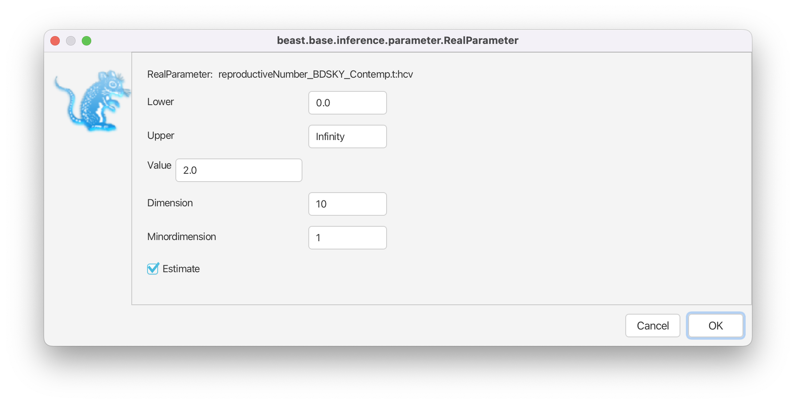

# Background

Population dynamics influence the shape of the tree and consequently, the shape of the tree contains some information about past population dynamics. The so-called Skyline methods allow to extract this information from phylogenetic trees in a non-parametric manner. It is non-parametric since there is no underlying system of differential equations governing the inference of these dynamics. In this tutorial we will look at two different methods to infer these dynamics from sequence data. The first one is the Bayesian Coalescent Skyline plot , which is based on the coalescent model, and the second one is the Birth-Death skyline  plot based on the birth-death model. The conceptual difference between coalescent and birth-death approaches lies in the direction of the flow of time. In the coalescent, the time is modeled to go backwards, from present to past, while in the birth-death approach it is modeled to go forwards. Two other fundamental differences are the parameters that are inferred and the way sampling is treated. 

----

# Programs used in this Exercise


### BEAST2 - Bayesian Evolutionary Analysis Sampling Trees 2

BEAST2 is a free software package for Bayesian evolutionary analysis of molecular sequences using MCMC and strictly oriented toward inference using rooted, time-measured phylogenetic trees . This tutorial uses the BEAST2 version 2.4.2.


### BEAUti - Bayesian Evolutionary Analysis Utility

BEAUti is a graphical user interface tool for generating BEAST2 XML configuration files.


### Tracer

[Tracer](http://tree.bio.ed.ac.uk/software/tracer) is used to summarise the posterior estimates of the various parameters sampled by the Markov chain. This program can be used for visual inspection and assessment of convergence. It helps to quickly view median estimates 95% highest posterior density intervals of the parameters, and calculates the effective sample sizes (ESS) of parameters. It also helps to visualise potential parameter correlations.


### R

We will be using [R](\href{https://www.r-project.org) to analyze the output of the birth-death skyline plot. We will start the provided R script from the terminal, hence there is no need for applications like RStudio, which provides a graphical user interface for R. If you prefer using RStudio feel free to do so.

----


# Practical: Bayesian and birth-death skyline plot

In this tutorial we will estimate the dynamics of the Egyptian Hepatitis C epidemic from genetic sequence data collected in 1993.

The aim of this tutorial is to:
- Learn how to infer population dynamics;
- Get to know how to choose the set-up of a skyline analysis;
- Get to know the advantages and disadvantages of the Bayesian Coalescent Skyline and the Birth-Death Skyline.


## The Data
The dataset consists of an alignment of 63 Hepatitis C sequences sampled in 1993 in Egypt . This dataset has been used previously to test the performance of skyline methods .

With an estimated 15-25%, Egypt has the highest Hepatits C prevalence in the world. In the mid 20^(th) century, the prevalence of Hepatitis C increased drastically (see [Figure 1](#fig:prevalence) for estimates). We will try to infer this increase from sequence data. 

<figure>
	<a id="fig:prevalence"></a>
	
	<figcaption>Figure 1: The estimated number of Hepatitis C cases in Egypt .</figcaption>
</figure>
<br>


## Creating the Analysis File with BEAUti

We will use BEAUti to generate the configuration file for BEAST2 from the sequence alignment.

### Install BEAST 2 Plug-Ins

While the Bayesian Coalescent Skyline plot is integrated in the core of BEAST2, we need to install the BDSKY package, which contains the birth-death skyline plot functionality. Installation of packages is done using the package manager, which is integrated into BEAUti. Open the package manager with `File > Manage Packages` in BEAUti. Select the BDSKY package and install it using the `Install/Upgrade` button ([Figure 2](#fig:install)).

<figure>
	<a id="fig:install"></a>
	
	<figcaption>Figure 2: Install the package BDSKY which contains the birth-death skyline functionality.</figcaption>
</figure>
<br>

----

### Setting up the analysis with Bayesian Coalescent Skyline

To import the aligned sequences into BEAUti, use `File > Import Alignment` to select the `*.nexus` file.

BEAUti will recognize the sequences from the `*.nexus` file as nucleotide data. It will do so for sequence files with the character set of **A | C | G | T | N**, where **N** indicates an unknown nucleotide. As soon as other non-gap characters are included (e.g. using **R** or **Y** to indicate purines and pyramidines) BEAUti will not recognize the data as nucleotides anymore, unless the type of data is specified in the `*.nexus` file.

After we have loaded the sequences into BEAUti, we have to specify the evolutionary model. We will be using the very general GTR model ([Figure 3](#fig:model)), which estimates transition probabilities between individual nucleotides separately, meaning that transition probabilities between e.g. **A** and **T** will be inferred separately to the ones between **A** and **C**. Additionally, we should allow for rate heterogeneity among sites. We can do this by changing the Gamma Category Count to 4 (normally between 4 and 6).

<figure>
	<a id="fig:model"></a>
	
	<figcaption>Figure 3: Set GTR as a site model. Also use a Gamma Category Count of 4.</figcaption>
</figure>
<br>

As we use sequences that were sampled at the same point in time, we need to fix the clock rate (for more information on this please refer to the tutorial on molecular clocks). We will use an estimate inferred in  to fix the clock rate. In this case all the samples were contemporaneous (at the same time) and the clock rate works as a mapping of the estimated tree branch lengths into calendar time.

We will keep the strict clock model and will set `Clock.rate` to 0.00079.

Next, we need to go the the `Priors` tab and set the Bayesian Coalescent Skyline as a tree prior ([Figure 4](#fig:coalescent)).

<figure>
	<a id="fig:coalescent"></a>
	
	<figcaption>Figure 4: Choose the Coalescent Bayesian Skyline as a population prior.</figcaption>
</figure>
<br>

The Bayesian Coalescent Skyline works by dividing the time between the present and the root of the tree into intervals, thus the number of these intervals has to be defined. Each interval will have a different effective population size. 
The Bayesian Coalescent Skyline will estimate the number of coalescent events within each interval (which is captured in the Group Size parameter) as well as the effective population size for that interval. The number of intervals is equal to the dimension specified. If we have   intervals, the effective population size is allowed to change  times. To specify the number of dimensions, we need to first go to the initialization panel. This is by default not visible `View > Show Initialization Panel`.

For this analysis we will set the number of dimensions to 4 (the default value is 5). Keep in mind that one has to change the dimension of `bPopSizes` as well as `bGroupSizes`. The dimension of both parameters has to be the same ([Figure 5](#fig:dimensions)).

<figure>
	<a id="fig:dimensions"></a>
	
	<figcaption>Figure 5: Set the dimension of the two parameters, `bPopSizes` and `bGroupSizes`, to 4.</figcaption>
</figure>
<br>

Choosing the dimension for the Bayesian Coalescent Skyline can be rather arbitrary. If the dimension is chosen too low, not all population changes are captured, if it is chosen too large, there might be too little information in an interval to support an estimate of a population size. There are implementations in BEAST of the coalescent skyline that either sample dimensions (Extended Bayesian Skyline ) or do not require dimensions to be specified (Skyride ).

We can leave the priors as they are and save the settings to `*.xml`.


### Effective Population Size


The effective population size is the inverse of the rate of coalescence . The larger the effective population size  the less likely lineages are to coalesce.



For an SIR model (**S**usceptible, **I**nfected and **R**ecovered), it is proportional to the overall population size  and the number of infected  and inversely proportional to the transmission rate . 




Estimates of the effective population size  therefore do not directly tell us something about the number of infected, nor the transmission rate. Changes of e.g. the transmission rate or the number of infected can show in the effective population size (if they do not cancel out).

<figure>
	<a id="fig:coal_principle"></a>
	
	<figcaption>Figure 6: Example tree where the red dotted lines show the time-points of coalescent events.</figcaption>
</figure>
<br>

What the Bayesian Coalescent Skyline is doing is dividing the full tree into dimension  intervals between coalescent events. It then estimates based on what happens in those intervals, what the effective population size is (the actual estimation additionally involves smoothing priors which restrict the difference in effective population sizes between two intervals). The length of an interval is therefore not a fixed value but dependent on where the coalescent events are ([Figure 6](#fig:coal_principle), compare later to [Figure XX](#fig:bdsky_principle) for the birth-death skyline), as well as the number of events contained within an interval (the `GroupSize` parameter). Intervals are grouped together, because as [Figure 6](#fig:coal_principle) shows, some of the intervals can be very small, which may lead to erratic estimates. Grouping intervals together leads to smoother estimates.


### Exploring the results of Bayesian Coalescent Skyline analysis

For the reconstruction of the population dynamics, we need two files: the `*.log` file and the `*.trees` file. The log files contain the information about the group size and the population size. The group size specifies how many intervals are combined to have the same effective population size. 

After the runs have finished, load the finished `*.log` file into Tracer. Alternatively you can use the `*.log` files and the `*.trees` files you downloaded with the data. To run the analysis, open the finished `*.log` file into Tracer, then go to `Analysis > Bayesian Skyline Reconstruction`. From there open the finished `*.trees` file. To get the correct years in the analysis we should specify the `Age of the youngest tip`. In our case it is 1993, the year where all the samples were taken. If the samples were taken through time, the age of the youngest tip is the time when the most recent sample was taken. If you now press the `Ok` button, the reconstruction of the past population dynamics will be performed ([Figure 7](#fig:trees)).

<figure>
	<a id="fig:trees"></a>
	
	<figcaption>Figure 7: Reconstructing the Bayesian Skyline plot in Tracer.</figcaption>
</figure>
<br>

The output will have the years on the x-axis and the effective population size on the y-axis. By default, the y-axis is on a log-scale. If everything worked as it is supposed to work you will see a sharp increase in the effective population size in the mid 20^(th) century, similar to what is seen on [Figure 8](#fig:skyline).

<figure>
	<a id="fig:skyline"></a>
	
	<figcaption>Figure 8: Bayesian Coalescent Skyline analysis output. The black line is the median estimate of the estimated effective population size (can be changed to the mean estimate). The two blue lines are the upper an the lower estimates of 95% interval. The x-axis is the time in years.</figcaption>
</figure>
<br>

There are two ways to save the analysis, it can either be saved as a `*.pdf` or as a tab delimited file. To save it as a tab delimited file, you can go to `File > Export Data`. The exported file will have five rows, the time, the mean, median lower 95\% interval and the upper 95\% interval of the estimates, which you can use to plot the data with other software (R, Matlab, etc).


### Choosing the Dimension

If we compare the estimates of the population dynamics using different dimensions, we see that most of the dynamics are already captured with having only 2 dimensions, as shown in [Figure 9](#fig:comparison). Adding more dimensions mainly only changes the inferred effective population size before 1900. Note that adding more dimensions adds a slight dip before the increase in the effective population size (around 1900). When comparing to the HPD intervals ([Figure 8](#fig:skyline)) we see that this dip is not significant and may not be indicative of a real decrease in the effective population size before the subsequent increase.


<figure>
	<a id="fig:comparison"></a>
	
	<figcaption>Figure 9: Estimated mean effective population sizes using different dimensions.</figcaption>
</figure>
<br>

The choice of the number of dimensions can also have a direct effect on how fast the MCMC converges ([Figure 10](#fig:ess)). The slower convergence with increasing dimension can be caused by e.g. less information in intervals. To some extent it is simply caused by the need to estimate more parameters though.

<figure>
	<a id="fig:ess"></a>
	
	<figcaption>Figure 10: The ESS value of the posterior after running an MCMC chain with 10^7 samples, logged every 10^3 steps and a burnin of 10% for using different dimensions of the Bayesian Coalescent Skyline.</figcaption>
</figure>
<br>

----

### Birth-Death Skyline

In the first analysis, we used the coalescent approach to estimate population dynamics, we now want to do the inference using the birth-death skyline model. We will mostly need the same setups as for the previous analysis. In case you closed BEAUti, you can reopen the previously used configuration file in BEAUti (`File > Load` the `*.xml`) and modify it to have a birth-death skyline prior on the tree. We will need to set the prior to `Birth Death Skyline Contemporary`, since the sequences were all sampled at the same point in time (see [Figure 11](#fig:bdsky)). For samples that were taken through time, we would take `Birth Death Skyline Serial`.


<figure>
	<a id="fig:bdsky"></a>
	
	<figcaption>Figure 11: Setting the prior on the tree to the birth-death skyline.</figcaption>
</figure>
<br>

As in the Bayesian Coalescent Skyline, we need to choose the number of dimensions. Here we choose the dimensions for the , the basic reproduction number, which denotes the number of secondary infections caused by a single infected person in a completely susceptible population, i.e. an  of 2 would mean that every infected person causes two new infections on average. Or in other words, an  above 1 means that the number of cases are increasing, therefore the disease will cause an epidemic, and an  below 1 means that the epidemic will die out. (Note that since the birth-death skyline infers changes in  over time, it technically infers the effective reproduction number, the average number of new infections caused by an infected person at a certain time during the outbreak).

The dimension of the  has to be chosen in the initialization panel. Choosing this dimension can again be arbitrary and may require the testing of a few different values. Too few intervals and not all rate shifts are captured. Too many intervals and the intervals may not contain enough information to infer parameters.

In this case we will keep the default value of 10 dimensions ([Figure 12](#fig:dimensions_bdsky)).

<figure>
	<a id="fig:dimensions_bdsky"></a>
	
	<figcaption>Figure 12: Setting the dimensions for R$_0$ estimates.</figcaption>
</figure>
<br>

<figure>
	<a id="fig:bdsky_model"></a>
	
	<figcaption>Figure 13: A schematic of the BDSKY model.</figcaption>
</figure>
<br>

BDSKY infers 3 parameters ([Figure 13](#fig:bdsky_model)), the transmission rate , the becoming noninfectious rate  and the sampling proportion,  (when the samples were taken at the same time) or the sampling proportion,  (when the samples were taken through time). The  is then a function of those values (more about that later).
The rates we estimate using the birth-death model are per lineage rates. Some of these rates we know or we can estimate them from other data. The becoming noninfectious rate for example, we can get from the average time a patient can transmit a disease. This prior knowledge we can incorporate in the MCMC.
This we can do in the `Priors` panel. We can use prior information about the , the becoming noninfectious rate, the origin and  (Figures [14](#fig:r0prior),[15](#)fig:bURprior),[16](#fig:oriprior),[17](#fig:rhoprior)). Note that the origin inferred by the birth-death skyline is not the time of the most recent common ancestor of the tree (TMRCA), but is earlier and denotes the start of the outbreak, i.e. when there was only one infected person. 

We use a lognormal prior for . This is a good prior distribution to use for rates since it is always positive (a rate cannot be negative) and has a long tail defined over all positive numbers. The long tail allows arbitrarily high estimates of , but does not place much weight on very high rates. This agrees with our prior knowledge about the  of other diseases (most diseases have an  between 1.2 and 5. Measles is one of the most infectious diseases we know about and has an  of around 18). 

If an epidemic is neither growing nor declining, it has an  of 1, which we will use as a null hypothesis (we assume that as long as there is no strong signal in an interval for an epidemic to grow or decline that the  is 1, i.e. the epidemic stays constant). Thus, we set the mean of the lognormal distribution to 0, which results in a median of 1. We set the variance to 1.25, which places most weight below 7.82 (95% quantile). ([Figure 14](#fig:r0prior)).

<figure>
	<a id="fig:r0prior"></a>
	
	<figcaption>Figure 14: Setting the  prior.</figcaption>
</figure>
<br>

For the becoming noninfectious rate we again use a lognormal prior. The inverse of the becoming noninfectious rate is the average infectious period. In some patients an HCV infection only lasts a few weeks, while in others it is a chronic infection lasting for many years. Setting  and  results in the same prior we used for the  ([Figure 15](#fig:bURprior)).  In terms of the becoming noninfectious rate, this translates to the 95% quantiles for the infectious period falling between 0.128 years (46.67 days) and 11.59 years, with a median of 1 year. We will see later that there is a strong signal in the data for a longer becoming noninfectious period. 

<figure>
	<a id="fig:bURprior"></a>
	
	<figcaption>Figure 15: Setting the becoming noninfectious prior.</figcaption>
</figure>
<br>

For the origin of the epidemic we once again use a lognormal prior. Note that the origin also has to be positive and needs to be bigger than the MRCA of the tree. We know that HCV has been circulating in Egypt for at least a hundred years, so we set  and  ([Figure 16](#fig:oriprior)), resulting in a median prior estimate for the origin of 148 years.

<figure>
	<a id="fig:oriprior"></a>
	
	<figcaption>Figure 16: Setting the prior on the origin of the epidemic.</figcaption>
</figure>
<br>

Finally, we need a prior for the sampling probability, , which represents the proportion of HCV cases in Egypt in 1993, included in the analysis. Egypt had a population of roughly 60 million in 1993, and with a prevalence of at least 15% this translates into millions of cases, whereas we have only 63 sequences. 

We use a beta distribution for the prior on . Beta distributions are a very flexible class of distributions that are only defined between 0 and 1, making them ideal to use for proportions. We set Alpha to 1 and Beta to 9999, reflecting our prior knowledge that we have only a minuscule fraction of all cases in our dataset ([Figure 17](#fig:rhoprior)).

<figure>
	<a id="fig:rhoprior"></a>
	
	<figcaption>Figure 17: Setting the prior on .</figcaption>
</figure>
<br>

We can leave the rest of the priors as they are. First, we should increase the chain length (at least double it). To not get too large log files, we can increase the `sampling every` to 2000 (reducing the sampling frequency). Now we can change the names of the output files. If we want to run the analysis in the same directory as the coalescent analyses, the output files and the `*.xml` name need to be different.


### The parameterization of the Birth-Death Model

The Birth-Death model is parameterized very differently from the coalescent model. While the coalescent uses the effective population size, which as the name already tells us is defined on a population level, the birth-death model uses per lineage rates. The transmission rate  tells us at which rate infected individuals infect susceptibles. This rate is also referred to as the birth rate. The sampling rate  and the sampling probability  describe how likely it is for an infected individual to be sampled and therefore how likely they are to appear in the tree as tips. The becoming noninfectious rate  is the sum of the death rate  and the sampling rate .



The death rate  is the rate at which lineages disappear (go extinct) from a population without being sampled. You can also see from the above equation that we assume that a sampled lineage cannot transmit anymore. The consequence for the phylogeny is that a sampled lineage cannot be an ancestor of any lineage. This assumption can be relaxed, but we will not do so during this tutorial.

The  we estimate is then defined as follows:



    |                                                          |         
--------------------------------------------------------------:|:----------------------
if  then  | epidemic grows
if  then  | epidemic stays constant
if  then  | epidemic declines

The birth-death skyline allows these rates to change over time. This is done by dividing the time from the origin (of the epidemic, which is not necessarily the same as the root of the tree) to the most recent sample into dimension  equally spaced intervals (see [Figure 18](#fig:bdsky_principle)). The rates are then allowed to change between two intervals. Within an interval rates are constant. In principle, all rates in all intervals could be different. Since the transmission rate and the becoming noninfectious rate are highly correlated, this is not always practical. Often we assume the becoming noninfectious rate to be the same in all intervals while changing the transmission rate . 

<figure>
	<a id="fig:bdsky_principle"></a>
	
	<figcaption>Figure 18: Example tree where the red dotted lines are an example of where rates could be allowed to change on the tree. The branch at the root (compare [Figure 6](#fig:coal_principle)) is indicating the origin of the epidemic, which is also estimated in the BDSKY.</figcaption>
</figure>
<br>


There are some clear differences between the birth-death and the coalescent skyline. First, the way intervals are defined. In the coalescent skyline, intervals are always between coalescent events, while this restriction does not exist for the birth-death skyline. Second, the birth-death skyline does not infer changes in population sizes.

The coalescent on the other hand does infer the effective population size, which is a parameter proportional to absolute sizes. The third difference is the inference of the origin of an epidemic by the birth death model, which is not done by the coalescent.


### Visualizing the Birth-Death Skyline Output

There is no equivalent visualization of the `*.log` file of a BDSKY analysis in tracer as there is for the Bayesian Coalescent Skyline. But because BDSKY separates the full tree into equally spaced intervals, we can already get an idea of the inference just by looking at the inferred {$ eqinline R_0 %} values (see [Figure 19](#fig:bdsky_dynamics)). This gives us a good idea of the trend, but it is not completely accurate. Since every posterior sample has a different origin, the time spanned by each interval is slightly different in each posterior sample. Thus, the different intervals overlap slightly. The advantage to this is that we get a smooth estimate through time. The disadvantage is that we need to do some extra post-processing to plot the skyline.

<figure>
	<a id="fig:bdsky_dynamics"></a>
	
	<figcaption>Figure 19: Estimated population dynamics by BDSKY in Tracer.</figcaption>
</figure>
<br>


We will instead use some R scripts to plot the output of the bdsky. 
Open R and install two package using:

```{R}
install.packages("boa");
install.packages("RColorBrewer");
```

The first package is needed for statistical analyses of the run and the second one contains color schemes needed by the other R scripts. 
To plot the results, we need to describe in the file `Skyline_Example.R` where our `*.log` file is ([Figure 20](#fig:r_script)).

<figure>
	<a id="fig:r_script"></a>
	
	<figcaption>Figure 20: Put the path to the log file to fname in the R script.</figcaption>
</figure>
<br>

After saving the R script `Skyline_Example.R`, we can now plot the analysis.

First, replace `dir` with the path to the directory where the R scripts are stored and then source the scripts. By default this is the `scripts` directory inside the tutorial. The first 3 R scripts contain functions for reading BEAST2 log files, extracting HPD intervals and plotting skylines. (These files are part of an R package that will be available on CRAN in the nearby future. For the moment, if you are interested you are welcome to check out the development version at \url{http://github.com/laduplessis}  (Beta testers needed!)).

```R
source('/dir/Figure_Utilities.R');
source('/dir/Logfile_Utilities.R');
source('/dir/SkylinePlot.R');
```

Now you can either step through the commands in `Skyline_Example.R` one by one or source it as with the others,

```R
source('/dir/Skyline_Example.R');
```

First, the script loads the logfile and calculates the HPD intervals for  and the becoming noninfectious rate. 

```R
lf     <- readLogfile(fname, burnin=0.1) 
R0_sky <- getSkylineSubset(lf,"R0")

# Extract the raw HPDs 
R0_hpd    <- getMatrixHPD(R0_sky) 
delta_hpd <- getHPD(lf\$becomeUninfectiousRate) 
```

Next we plot the raw HPD intervals of . This is equivalent to the output in tracer. 

```R
plotSkyline(1:10, R0\hpd, type='step')
```

In order to plot the smooth skyline we have to calculate the HPD on a finer timegrid. To do this we first calculate the marginal posterior at every time of interest using the function `gridSkyline` and then calculate the HPD for each of the finer time intervals. 

```R
timegrid <- seq(1,400,length.out=100) 
R0_gridded     <- gridSkyline(R0_sky,    lf\$origin, timegrid) 
R0_gridded_hpd <- getMatrixHPD(R0_gridded)
```

Now we are ready to plot the smooth skyline

```R
# The plotting times, the most recent sample is 1993 
times <- 1993-timegrid 
plotSkyline(times, R0_gridded_hpd, type='smooth')
```

We can plot the gridded skyline (not its HPDs) for a few of the samples to see what it really looks like. Note that the intervals overlap between different posterior samples. This is because the origin is different in each sample. As we add more samples to the plot we start to see the smooth skyline appear. 

```R
plotSkyline(times, R0_gridded, type='steplines', traces=10, col=pal.dark(cblue,0.5),ylims=c(0,5)) 
plotSkyline(times, R0_gridded, type='steplines', traces=100, col=pal.dark(cblue,0.5),ylims=c(0,5)) 
plotSkyline(times, R0_gridded, type='steplines', traces=1000, col=pal.dark(cblue,0.1),ylims=c(0,5))
```

Finally, we can plot both the  and the becoming noninfectious rate on a single set of axes. Since we left the dimension of the becoming noninfectious rate at 1, it is constant through time. (Normally we would not plot constant parameters over a time period). The output should be similar to [Figure 21](#fig:bdsky_out).

```R
plotSkylinePretty(range(times), as.matrix(delta_hpd), type='step', axispadding=0.0, col=pal.dark(cblue), fill=pal.dark(cblue, 0.5), col.axis=pal.dark(cblue), 
ylab=expression(delta), side=4, yline=2, ylims=c(0,1), xaxis=FALSE) 

plotSkylinePretty(times, R0_gridded_hpd, type='smooth', axispadding=0.0, col=pal.dark(corange), fill=pal.dark(corange, 0.5), col.axis=pal.dark(corange), 
xlab="Time", ylab=expression("R"[0]), side=2, yline=2.5, xline=2, xgrid=TRUE, ygrid=TRUE, gridcol=pal.dark(cgray), ylims=c(0,3), new=TRUE, add=TRUE) 
```

<figure>
	<a id="fig:bdsky_output"></a>
	
	<figcaption>Figure 21: stimates of the inferred  (orange) over time and the estimate of the becoming un-infectious rate (blue), for which we only used one value.</figcaption>
</figure>
<br>

----

## Some considerations for using skyline plots

Both the coalescent and the birth-death skylines assume that the population is well-mixed. That is, they assume that there is no significant population structure and that the sequences are a random sample from the population. However, if there is population structure, for instance sequences were sampled from two different villages and there is much more contact within than between villages, then the results will be biased . Instead a structured model should be used to account for these biases.


----

# Useful Links

- [Bayesian Evolutionary Analysis with BEAST 2](http://www.beast2.org/book.html) 
- BEAST 2 website and documentation: [http://www.beast2.org/](http://www.beast2.org/)
- BEAST 1 website and documentation: [http://beast.bio.ed.ac.uk](http://beast.bio.ed.ac.uk)
- Join the BEAST user discussion: [http://groups.google.com/group/beast-users](http://groups.google.com/group/beast-users) 

----

This tutorial was written by Nicola Müller and Louis du Plessis for [Taming the BEAST](https://taming-the-beast.github.io) and is licensed under a [Creative Commons Attribution 4.0 International License](http://creativecommons.org/licenses/by/4.0/). 

----

# Relevant References




