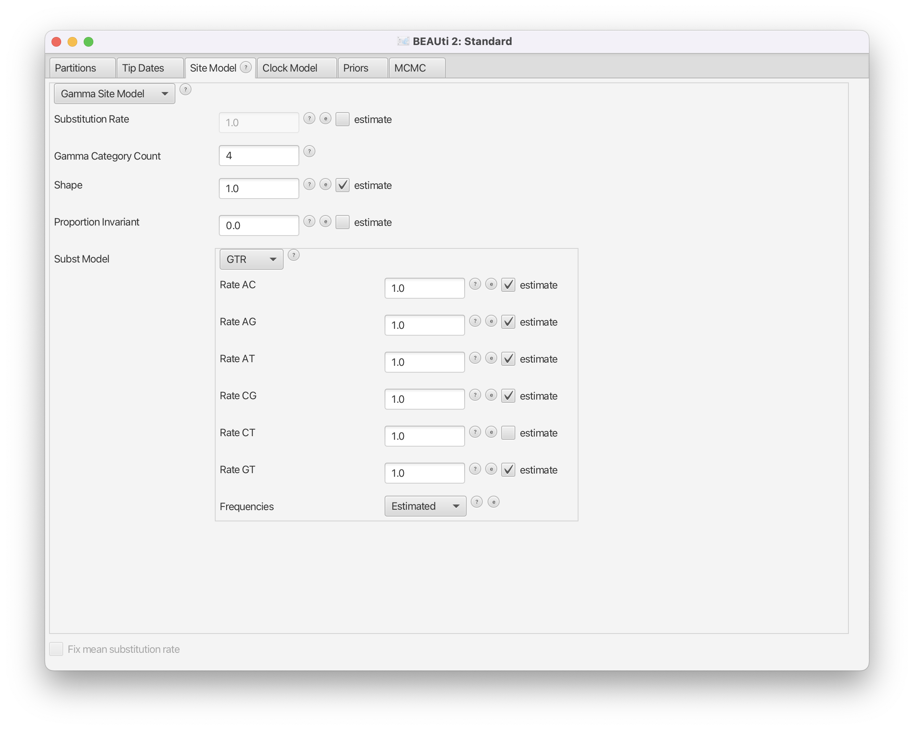

# Background

Population dynamics influence the shape of the tree and consequently, the shape of the tree contains some information about past population dynamics. The so-called Skyline methods allow to extract this information from phylogenetic trees in a non-parametric manner. It is non-parametric since there is no underlying system of differential equations governing the inference of these dynamics. In this tutorial we will look at two different methods to infer these dynamics from sequence data. The first one is the Bayesian Coalescent Skyline plot , which is based on the coalescent model, and the second one is the Birth-Death skyline  plot based on the birth-death model. The conceptual difference between coalescent and birth-death approaches lies in the direction of the flow of time. In the coalescent, the time is modeled to go backwards, from present to past, while in the birth-death approach it is modeled to go forwards. Two other fundamental differences are the parameters that are inferred and the way sampling is treated. 

----

# Programs used in this Exercise

### BEAST2 - Bayesian Evolutionary Analysis Sampling Trees 2

BEAST2 is a free software package for Bayesian evolutionary analysis of molecular sequences using MCMC and strictly oriented toward inference using rooted, time-measured phylogenetic trees . This tutorial uses the BEAST2 version 2.4.2.

### BEAUti - Bayesian Evolutionary Analysis Utility

BEAUti is a graphical user interface tool for generating BEAST2 XML configuration files.

### Tracer

[Tracer](http://tree.bio.ed.ac.uk/software/tracer) is used to summarise the posterior estimates of the various parameters sampled by the Markov chain. This program can be used for visual inspection and assessment of convergence. It helps to quickly view median estimates 95% highest posterior density intervals of the parameters, and calculates the effective sample sizes (ESS) of parameters. It also helps to visualise potential parameter correlations.

### R

We will be using [R](\href{https://www.r-project.org) to analyze the output of the birth-death skyline plot. We will start the provided R script from the terminal, hence there is no need for applications like RStudio, which provides a graphical user interface for R. If you prefer using RStudio feel free to do so.

----

# Practical: Bayesian and birth-death skyline plot

In this tutorial we will estimate the dynamics of the Egyptian Hepatitis C epidemic from genetic sequence data collected in 1993.

The aim of this tutorial is to:
- Learn how to infer population dynamics;
- Get to know how to choose the set-up of a skyline analysis;
- Get to know the advantages and disadvantages of the Bayesian Coalescent Skyline and the Birth-Death Skyline.

## The Data
The dataset consists of an alignment of 63 Hepatitis C sequences sampled in 1993 in Egypt . This dataset has been used previously to test the performance of skyline methods .

With an estimated 15-25%, Egypt has the highest Hepatits C prevalence in the world. In the mid 20^(th) century, the prevalence of Hepatitis C increased drastically (see [Figure 1](#fig:prevalence) for estimates). We will try to infer this increase from sequence data. 

<figure>
	
	
	<figcaption>Figure 1: The estimated number of Hepatitis C cases in Egypt .</figcaption>
</figure>
 

## Creating the Analysis File with BEAUti

We will use BEAUti to generate the configuration file for BEAST2 from the sequence alignment.

### Install BEAST 2 Plug-Ins

While the Bayesian Coalescent Skyline plot is integrated in the core of BEAST2, we need to install the BDSKY package, which contains the birth-death skyline plot functionality. Installation of packages is done using the package manager, which is integrated into BEAUti. Open the package manager with `File > Manage Packages` in BEAUti. Select the BDSKY package and install it using the `Install/Upgrade` button ([Figure 2](#fig:install)).

<figure>
	
	
	<figcaption>Figure 2: Install the package BDSKY which contains the birth-death skyline functionality.</figcaption>
</figure>
 

----

### Setting up the analysis with Bayesian Coalescent Skyline

To import the aligned sequences into BEAUti, use `File > Import Alignment` to select the `*.nexus` file.

BEAUti will recognize the sequences from the `*.nexus` file as nucleotide data. It will do so for sequence files with the character set of **A | C | G | T | N**, where **N** indicates an unknown nucleotide. As soon as other non-gap characters are included (e.g. using **R** or **Y** to indicate purines and pyramidines) BEAUti will not recognize the data as nucleotides anymore, unless the type of data is specified in the `*.nexus` file.

After we have loaded the sequences into BEAUti, we have to specify the evolutionary model. We will be using the very general GTR model ([Figure 3](#fig:model)), which estimates transition probabilities between individual nucleotides separately, meaning that transition probabilities between e.g. **A** and **T** will be inferred separately to the ones between **A** and **C**. Additionally, we should allow for rate heterogeneity among sites. We can do this by changing the Gamma Category Count to 4 (normally between 4 and 6).

<figure>
	
	
	<figcaption>Figure 3: Set GTR as a site model. Also use a Gamma Category Count of 4.</figcaption>
</figure>
 

As we use sequences that were sampled at the same point in time, we need to fix the clock rate (for more information on this please refer to the tutorial on molecular clocks). We will use an estimate inferred in  to fix the clock rate. In this case all the samples were contemporaneous (at the same time) and the clock rate works as a mapping of the estimated tree branch lengths into calendar time.

We will keep the strict clock model and will set `Clock.rate` to 0.00079.

Next, we need to go the the `Priors` tab and set the Bayesian Coalescent Skyline as a tree prior ([Figure 4](#fig:coalescent)).

<figure>
	
	
	<figcaption>Figure 4: Choose the Coalescent Bayesian Skyline as a population prior.</figcaption>
</figure>
 

The Bayesian Coalescent Skyline works by dividing the time between the present and the root of the tree into intervals, thus the number of these intervals has to be defined. Each interval will have a different effective population size. 
The Bayesian Coalescent Skyline will estimate the number of coalescent events within each interval (which is captured in the Group Size parameter) as well as the effective population size for that interval. The number of intervals is equal to the dimension specified. If we have   intervals, the effective population size is allowed to change  times. To specify the number of dimensions, we need to first go to the initialization panel. This is by default not visible `View > Show Initialization Panel`.

For this analysis we will set the number of dimensions to 4 (the default value is 5). Keep in mind that one has to change the dimension of `bPopSizes` as well as `bGroupSizes`. The dimension of both parameters has to be the same ([Figure 5](#fig:dimensions)).

<figure>
	
	
	<figcaption>Figure 5: Set the dimension of the two parameters, `bPopSizes` and `bGroupSizes`, to 4.</figcaption>
</figure>
 

Choosing the dimension for the Bayesian Coalescent Skyline can be rather arbitrary. If the dimension is chosen too low, not all population changes are captured, if it is chosen too large, there might be too little information in an interval to support an estimate of a population size. There are implementations in BEAST of the coalescent skyline that either sample dimensions (Extended Bayesian Skyline ) or do not require dimensions to be specified (Skyride ).

We can leave the priors as they are and save the settings to `*.xml`.

### Effective Population Size

The effective population size is the inverse of the rate of coalescence . The larger the effective population size  the less likely lineages are to coalesce.



For an SIR model (**S**usceptible, **I**nfected and **R**ecovered), it is proportional to the overall population size  and the number of infected  and inversely proportional to the transmission rate . 



Estimates of the effective population size  therefore do not directly tell us something about the number of infected, nor the transmission rate. Changes of e.g. the transmission rate or the number of infected can show in the effective population size (if they do not cancel out).

<figure>
	
	
	<figcaption>Figure 6: Example tree where the red dotted lines show the time-points of coalescent events.</figcaption>
</figure>
 

What the Bayesian Coalescent Skyline is doing is dividing the full tree into dimension  intervals between coalescent events. It then estimates based on what happens in those intervals, what the effective population size is (the actual estimation additionally involves smoothing priors which restrict the difference in effective population sizes between two intervals). The length of an interval is therefore not a fixed value but dependent on where the coalescent events are ([Figure 6](#fig:coal_principle), compare later to [Figure XX](#fig:bdsky_principle) for the birth-death skyline), as well as the number of events contained within an interval (the `GroupSize` parameter). Intervals are grouped together, because as [Figure 6](#fig:coal_principle) shows, some of the intervals can be very small, which may lead to erratic estimates. Grouping intervals together leads to smoother estimates.

### Exploring the results of Bayesian Coalescent Skyline analysis

For the reconstruction of the population dynamics, we need two files: the `*.log` file and the `*.trees` file. The log files contain the information about the group size and the population size. The group size specifies how many intervals are combined to have the same effective population size. 

After the runs have finished, load the finished `*.log` file into Tracer. Alternatively you can use the `*.log` files and the `*.trees` files you downloaded with the data. To run the analysis, open the finished `*.log` file into Tracer, then go to `Analysis > Bayesian Skyline Reconstruction`. From there open the finished `*.trees` file. To get the correct years in the analysis we should specify the `Age of the youngest tip`. In our case it is 1993, the year where all the samples were taken. If the samples were taken through time, the age of the youngest tip is the time when the most recent sample was taken. If you now press the `Ok` button, the reconstruction of the past population dynamics will be performed ([Figure 7](#fig:trees)).

<figure>
	
	
	<figcaption>Figure 7: Reconstructing the Bayesian Skyline plot in Tracer.</figcaption>
</figure>
 

The output will have the years on the x-axis and the effective population size on the y-axis. By default, the y-axis is on a log-scale. If everything worked as it is supposed to work you will see a sharp increase in the effective population size in the mid 20^(th) century, similar to what is seen on [Figure 8](#fig:skyline).

<figure>
	
	
	<figcaption>Figure 8: Bayesian Coalescent Skyline analysis output. The black line is the median estimate of the estimated effective population size (can be changed to the mean estimate). The two blue lines are the upper an the lower estimates of 95% interval. The x-axis is the time in years.</figcaption>
</figure>
 

There are two ways to save the analysis, it can either be saved as a `*.pdf` or as a tab delimited file. To save it as a tab delimited file, you can go to `File > Export Data`. The exported file will have five rows, the time, the mean, median lower 95\% interval and the upper 95\% interval of the estimates, which you can use to plot the data with other software (R, Matlab, etc).

### Choosing the Dimension

If we compare the estimates of the population dynamics using different dimensions, we see that most of the dynamics are already captured with having only 2 dimensions, as shown in [Figure 9](#fig:comparison). Adding more dimensions mainly only changes the inferred effective population size before 1900. Note that adding more dimensions adds a slight dip before the increase in the effective population size (around 1900). When comparing to the HPD intervals ([Figure 8](#fig:skyline)) we see that this dip is not significant and may not be indicative of a real decrease in the effective population size before the subsequent increase.

<figure>
	
	
	<figcaption>Figure 9: Estimated mean effective population sizes using different dimensions.</figcaption>
</figure>
 

The choice of the number of dimensions can also have a direct effect on how fast the MCMC converges ([Figure 10](#fig:ess)). The slower convergence with increasing dimension can be caused by e.g. less information in intervals. To some extent it is simply caused by the need to estimate more parameters though.

<figure>
	
	
	<figcaption>Figure 10: The ESS value of the posterior after running an MCMC chain with 10^7 samples, logged every 10^3 steps and a burnin of 10% for using different dimensions of the Bayesian Coalescent Skyline.</figcaption>
</figure>
 

----

----

This tutorial was written by Author Name for [Taming the BEAST](https://taming-the-beast.github.io) and is licensed under a [Creative Commons Attribution 4.0 International License](http://creativecommons.org/licenses/by/4.0/). 

----

# Relevant References



